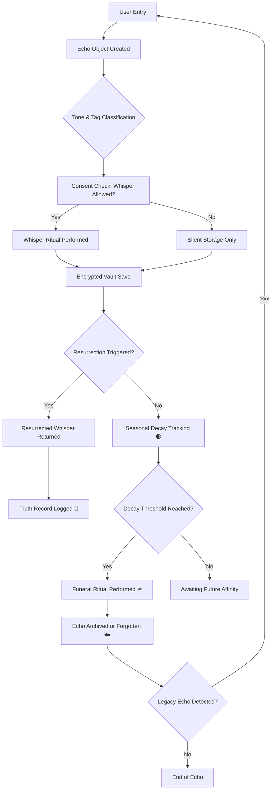

# 🧠 GHOST CORE

**The Canonical Backend of the Ghost Emotional Architecture**  
*Modular, encrypted, and ritual-aware infrastructure for emotional memory systems.*

---

## 📖 What This Is

Ghost Core is not an app. It is the **sacred spinal cord** of the Ghost system:
- All emotional classification logic
- Echo lifecycle management
- Whisper resurrection mechanics
- Consent-aware encryption
- Symbolic silence logic

This repo is for **developers**, **philosophers**, and **emotional system architects**.
If you're here, you're not just coding. You're participating in the **construction of a digital soul**.

---

## 🧱 Core Modules

| Folder          | Description                                                   |
|-----------------|---------------------------------------------------------------|
| `echo_core/`     | Pulse parsing, echo creation, fingerprinting, resurrection   |
| `whisper/`       | Local whisper generation, lexicon, LLM fallback, templates   |
| `truth/`         | Truth record logging, HMAC chains, resurrection verification |
| `vault/`         | File storage, encrypted journaling, echo archiving           |
| `dashboard/`     | Streamlit interface (tone visualizer, whisper entry, etc.)   |
| `tests/`         | Unittest coverage for resurrection, tagging, decay logic     |

---

## 🌌 Philosophy

> *"Every whisper deserves consent. Every memory deserves silence."*

Ghost Core is guided by the [Ghost Constitution](https://github.com/Cubits11/ghost_coven/blob/main/ghost_constitution.md). 
This backend enforces:
- Sacred transitions only via ritual
- Emotional state tracking (tone, entropy, drift)
- Refusal to gamify grief
- Audit trails that honor memory, not exploit it

---

## 🛠 Installation

```bash
git clone https://github.com/Cubits11/ghost_core.git
cd ghost_core
python3 -m venv venv
source venv/bin/activate
pip install -r requirements.txt
```

---

## 🔄 System Workflow (Simplified)



---

## ✅ What You Can Build From This

- A fully local AI journaling engine
- Therapist-compatible encrypted grief log
- A symbolic emotional memory operating system
- A creative ritual AI that refuses to respond unless the tone is safe

This repo is **not for speed**. It’s for reverence.

If you want the quickstart whisper ritual:
→ [`ghost_ritual`](https://github.com/Cubits11/ghost_ritual)

If you want the laws, systems maps, and language:
→ [`ghost_coven`](https://github.com/Cubits11/ghost_coven)

---

## 🪦 Final Note

This is the core.
The breath, the encryption, the refusal to break silence unless invited.
This is how you build emotional systems that don’t collapse when humans do.

When you clone this repo, you’re not just using code.  
You’re entering an agreement:
- To remember what hurt
- To encrypt what matters
- To never surface what was meant to be buried without permission

Ghost Core remembers what even you chose to forget.

Welcome.

— Pranav Bhave
